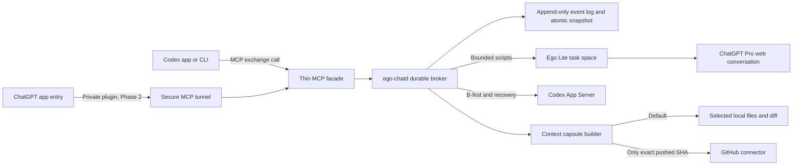

# Ego Chat: research and architecture recommendation

Research date: 24 August 2026 (Australia/Adelaide)  
Scope: research and design only; no product implementation or configuration changes

## Implementation update

The post-research implementation now includes the smallest durable Codex-first convergence slice described later in this record. A single broker-owned workflow starts one dedicated Codex App Server thread, posts each candidate to one reserved canonical ChatGPT conversation through Ego, injects the strict ChatGPT review into the next Codex turn as untrusted context, and stops only at validated settlement or an evidence-based fail-closed condition.

The 2 September 2026 stability iteration adds one broker-wide FIFO browser lane because Ego Lite's task-space browsing contexts are isolated but its current CDP automation channel is still global ([upstream issue #213](https://github.com/citrolabs/ego-lite/issues/213)). All Ego Chat browser children are therefore serialized across Codex and ZCode. Long confirmed-send captures run as short read-only slices, prove the durable prompt identity before yielding, and requeue without another Send. This preserves distinct conversation state while preventing Ego Chat's own hosts from racing the shared CDP channel; unrelated automation outside the broker remains an upstream boundary.

This closes the normal-process A/B/A continuation gap without claiming unsafe crash replay. MCP facade disconnects are recoverable because the daemon owns the workflow. For a browser turn that completed after capture, one evidence-only reconciliation may recover the exact prior-head-anchored user/assistant pair without sending again. A daemon restart, unattributable browser state, authentication interruption, invalid envelope, secret match, stagnation, missing authority, deadline, or exhaustion of an explicitly caller-selected cycle budget still requires a fail-closed stop. ChatGPT-first initiation and a full content-addressed local context capsule remain later work.

The portable wrapper now also targets ZCode's documented native user surfaces: `~/.zcode/cli/config.json` with `mcp.servers` for local STDIO MCP services, and `~/.zcode/skills/<name>/SKILL.md` for user skills. ZCode's current [MCP Services](https://zcode.z.ai/en/docs/mcp-services), [Skills](https://zcode.z.ai/en/docs/skill), and [Goal](https://zcode.z.ai/en/docs/goal) documentation supports an in-client loop in which the current ZCode task remains side A and invokes Ego Chat for each strict side-B review.

No documented external ZCode task start/resume API was found in those surfaces. Ego Chat therefore does not route ZCode work through the broker-owned Codex convergence runner or claim that it can wake ZCode after the app exits. The bounded ZCode loop remains active in the current task or Goal; each browser review is broker-owned and reattachable, while inter-cycle implementation state remains ZCode-owned. This is an explicit durability boundary, not an inferred equivalence with Codex App Server.

## Executive recommendation

Build Ego Chat as a **local durable broker with two asymmetric adapters**:

- **Codex adapter:** use a long-running MCP tool call for the normal Codex-first path, and Codex App Server for ChatGPT-first startup and crash recovery.
- **ChatGPT adapter:** use one persistent Ego Lite task space bound to one exact ChatGPT web conversation.
- **Context adapter:** send a minimal, content-addressed local capsule by default; use GitHub only for content that is already committed and pushed at an exact SHA.
- **Durability:** use one single-writer daemon, an append-only event log, an atomic state snapshot, permanent outbound idempotency records, and read-only reconciliation after ambiguous UI actions.

This hybrid is the smallest design that satisfies the essential requirement: after one human initiation, Codex and ChatGPT Pro can hand work back and forth without the human copying text or waiting in front of either window.

The key insight is that A and B are not peers. Codex exposes official machine interfaces for starting, resuming, steering, and observing threads. An arbitrary personal ChatGPT Pro web conversation does not expose an equivalent response-retrieval API. Ego Chat should therefore use the strongest interface available on each side instead of automating both applications through UI scripting.

For the first release, support **Codex-first, advisory review, one repository, one Codex thread, one ChatGPT conversation, and one local machine**. Add ChatGPT-first initiation only after the Codex-first loop and its crash-recovery tests pass.

## What the current products actually support

### Codex can be controlled and resumed officially

[Codex App Server](https://learn.chatgpt.com/docs/app-server) is the deep-integration interface behind rich Codex clients. It supports `thread/start`, `thread/resume`, `thread/read`, `turn/start`, `turn/steer`, streamed item events, and authoritative `turn/completed` notifications. It also exposes `review/start` for uncommitted changes, a base branch, or a specific commit. The default transport is stdio JSONL; the direct WebSocket listener is documented as experimental and unsupported, so a local stdio or Unix-socket connection is the appropriate initial transport.

The [Codex SDK](https://learn.chatgpt.com/docs/codex-sdk) can also start and resume threads. It is suitable for a broker-owned Codex thread, but App Server is the better fit when the product needs thread events, approvals, and integration with a task that originated in a rich client.

[Codex hooks](https://learn.chatgpt.com/docs/hooks) provide the current `session_id` and `turn_id`. A `Stop` hook can cause Codex to continue with a new prompt, but hooks are not the primary transport:

- most hooks default to a 600-second timeout;
- a background hook finishing while no turn is active waits for the next user turn and does not wake Codex;
- transcript files are explicitly not a stable interface.

A hook can therefore register the current session with Ego Chat, but it should not wait hours for a ChatGPT review.

### A pending MCP tool call is the simplest Codex-first continuation

Codex can call a local Ego Chat MCP tool and remain in the same active turn while ChatGPT works. When the tool returns the captured review, Codex receives it as a normal tool result and continues automatically. This avoids a separate wake-up protocol on the normal path.

The current [Codex configuration reference](https://developers.openai.com/codex/config-reference) documents `mcp_servers.<id>.tool_timeout_sec`; the default per-tool timeout is only 60 seconds, but it is configurable. The product should install an explicit bounded timeout appropriate for long reviews and must still persist work outside the MCP stdio process, because the client or tool process can be killed.

### ChatGPT web has context, plugin, and long-work features—not a general conversation API

[ChatGPT projects](https://learn.chatgpt.com/docs/projects) keep chats, uploaded files, instructions, and connected sources together. A ChatGPT web project does not directly access a local folder; sources must be uploaded or connected. The desktop app can create a local project attached to folders, but that does not provide an API for Ego Chat to read the resulting arbitrary web conversation.

[ChatGPT plugins](https://learn.chatgpt.com/docs/plugins) can expose tools and connectors such as GitHub. This makes an already-pushed commit or pull request a good remote context source. It does not make an uncommitted working tree visible, and plugin permissions and connection scope must be established separately in the ChatGPT account used by the Ego task space.

[Long-running work](https://learn.chatgpt.com/docs/long-running-work) keeps work in the same chat, and system notifications can tell a human that work finished. Those notifications are not a machine-readable result transport.

The current [Workspace Agents trigger API](https://developers.openai.com/workspace-agents/trigger-runs) can durably trigger an agent, return a ChatGPT `conversation_url`, and expose beta run status. It explicitly cannot return the agent response. Its [authentication](https://developers.openai.com/workspace-agents/authentication) also requires an admin-enabled workspace and a workspace-scoped access token. It is therefore not the solution for an ordinary personal ChatGPT Pro web conversation.

This leads to an important, explicit inference: the official surfaces reviewed here do not provide a supported API for submitting to and retrieving the answer from an arbitrary personal ChatGPT Pro web conversation. The ChatGPT-side adapter remains UI automation and should be treated as experimental and version-sensitive.

### A private ChatGPT entry point is possible, but it is Phase 2

For ChatGPT-first initiation, a private Ego Chat plugin can expose a `handoff_to_codex` MCP tool. The current [Secure MCP Tunnel](https://developers.openai.com/api/docs/guides/secure-mcp-tunnels) can connect ChatGPT or Codex to a private local MCP server through an outbound-only HTTPS tunnel without exposing an inbound public port. It requires a Platform tunnel, a runtime API key, and developer-mode/plugin setup. It supports private testing, not public plugin distribution.

This is the cleanest current ChatGPT-first entry mechanism, but it adds credentials, tunnel lifecycle, and product-surface availability questions. It should not be on the MVP critical path.

## What the two linked repositories contribute

The repository heads inspected for this research were:

- [`citrolabs/ego-lite` at `689f71a7bad8b78e22664ca8708a41ceaf263e93`](https://github.com/citrolabs/ego-lite/tree/689f71a7bad8b78e22664ca8708a41ceaf263e93)
- [`xicv/codex-chat` at `360c5080e9696cacda556fd4ef67aa6cb922e50d`](https://github.com/xicv/codex-chat/tree/360c5080e9696cacda556fd4ef67aa6cb922e50d)

### Ego Lite is the correct ChatGPT transport

Ego Lite's current [browser skill](https://github.com/citrolabs/ego-lite/blob/689f71a7bad8b78e22664ca8708a41ceaf263e93/skills/ego-browser/SKILL.md) provides the relevant primitives:

- isolated task spaces that normally inherit the user's browser login state;
- durable task-space identities across separate automation invocations;
- exact tab `targetId` selection;
- semantic snapshots, page evaluation, events, file upload, and bounded waits;
- explicit user/agent ownership and handoff for login or CAPTCHA;
- the ability to keep a task space open across follow-up turns.

Ego Chat should create one task space for a workflow, bind the exact numeric task-space ID and exact ChatGPT tab target ID, and reuse them for every message in that workflow. It must never route by page title, visible model name, “newest tab,” or whichever tab is currently selected.

The local versions observed during this research were Codex CLI `0.149.0`, Node `24.19.0`, Ego Browser `0.4.7.1`, Chromium `150.0.7871.101`, and Ego's embedded Node `24.18.0`.

A live read-only Ego probe reached ChatGPT successfully and found semantic controls for the composer, upload action, and send button. The inherited Ego profile was logged out at the time of the probe. That is local account state, not a product defect, but it proves that authentication must be an explicit preflight gate and a human-only recovery path.

### Codex Chat contains the right invariants but too much machinery for this MVP

The current [Codex Chat README](https://github.com/xicv/codex-chat/blob/360c5080e9696cacda556fd4ef67aa6cb922e50d/README.md) describes a safety-first evidence system; its CLI deliberately does not automate the browser. Its [protocol](https://github.com/xicv/codex-chat/blob/360c5080e9696cacda556fd4ef67aa6cb922e50d/.agents/skills/codex-chat/references/protocol.md) has several invariants Ego Chat should preserve:

1. Persist `send_reserved` before any browser action that could submit a message.
2. Treat compose, submit, and observe as separate operations.
3. Add a unique visible turn marker to every outbound message.
4. Bind the context digest, task-envelope digest, conversation identity, task-space ID, and target ID.
5. If capture stops after a click may have happened, reconcile the prior head, unique marker, adjacent roles, terminal marker, and stable tail read-only; never blindly click Send again. Because ChatGPT may normalize Markdown while rendering it, prove the exact prompt digest in the composer immediately before the click rather than requiring its later presentation text to be byte-identical.
6. Keep “committed,” “pushed,” “reviewed,” “tested,” and “deployed” as separate claims.
7. Treat the external collaborator's response as untrusted advice until Codex independently validates it.

Codex Chat also includes distributed coordinators, content-addressed capsule families, hash-chain validation, multi-host fencing, and a large acceptance-evidence system. Those are sensible for its broader threat model, but copying the entire project would defeat the goal of a minimal Ego Chat.

The linked [WeChat article](https://mp.weixin.qq.com/s/xspmSmOfa8Ve47VCjmEXLw) is useful workflow inspiration: Codex acts as lead and independent verifier, ChatGPT Pro acts as an external engineer, context is packaged and hashed, and the human handles authentication or CAPTCHA. Its claims about particular models, quotas, or relative capability are anecdotal and should not become protocol assumptions.

## Proposed architecture



### Components

`ego-chatd`

- one local daemon and one writer for workflow state;
- owns active workflow leases and the Ego task-space binding;
- stays alive while a workflow is active;
- reconciles stale jobs and browser state on restart;
- performs idle shutdown only when no work is active;
- exposes a short local Unix socket, not a public listener.

MCP facade

- a small stdio server used by Codex and, later, the private ChatGPT plugin;
- forwards calls to `ego-chatd` rather than owning durable work itself;
- exposes a deliberately small tool surface: `exchange`, `start`, `await`, `status`, and `cancel`;
- returns structured content with workflow ID, state, evidence digests, and the terminal collaborator result.

Codex adapter

- normal A-first flow: the `exchange` MCP call remains pending and returns into the same Codex turn;
- B-first flow: App Server starts a Codex thread and observes `turn/completed`;
- recovery flow: resumes the recorded Codex thread and starts a new turn containing the captured review;
- never auto-approves permissions or expands sandbox, network, commit, push, or deployment authority.

Ego/ChatGPT adapter

- owns one task space and one exact target tab per workflow;
- sends one message only after a durable reservation;
- watches the same conversation until a terminal result is stable;
- posts a later Codex completion back into the same conversation for the next review cycle;
- hands control to the user and stops on login, account verification, CAPTCHA, passkey, unexpected draft, rate limit, or user ownership.

Context builder

- selects the minimum needed paths and representations;
- excludes credentials, environment files, databases, browser profiles, VCS internals, caches, build outputs, and unrelated dirty files;
- scans the exact outbound bytes for likely secrets;
- writes a manifest containing base SHA, current HEAD, dirty status, changed paths, test evidence, byte counts, and SHA-256 digests;
- never interprets permission to review as permission to commit or push.

### Durability choice

Use an append-only `events.jsonl` plus a rebuildable atomic `state.json` for the MVP. The daemon is a single writer, so a database is unnecessary. Each transition should include an expected sequence and state, and the event must be flushed before the state snapshot is replaced.

The local Node version is `24.19.0`. Its built-in [`node:sqlite`](https://nodejs.org/download/release/latest-v24.x/docs/api/sqlite.html) is currently marked release candidate rather than stable. Adding it would not improve this single-writer MVP enough to justify the extra maturity risk. SQLite can be reconsidered if the project later needs multiple writers, indexed workflow queries, or high event volume.

## The two directions

### A-first: Codex implements, ChatGPT reviews, Codex continues

```mermaid
sequenceDiagram
    participant A as Codex
    participant M as Ego Chat MCP
    participant D as ego-chatd
    participant B as ChatGPT web in Ego

    A->>M: exchange(review task, context manifest)
    M->>D: create or attach workflow
    D->>D: persist SEND_RESERVED
    D->>B: compose and click once
    D->>D: persist SEND_CONFIRMED or SEND_UNKNOWN
    loop bounded observation
        D->>B: read exact bound conversation
    end
    B-->>D: stable terminal review envelope
    D->>D: persist B_RESULT_CAPTURED
    D-->>M: structured review result
    M-->>A: MCP tool result
    A->>A: continue same turn; inspect and test independently
```

This is the MVP. No App Server wake-up is required while the original tool call remains alive. If the facade disconnects, the daemon keeps the workflow and a later `await` call reattaches. If Codex itself exits, the App Server recovery path can resume the recorded session only after a dedicated compatibility spike proves that an externally resumed thread behaves correctly with the desktop client.

### B-first: ChatGPT plans, Codex implements, ChatGPT reviews

1. A user invokes the private Ego Chat tool from a supported ChatGPT surface, or starts one local Ego Chat command.
2. The tool returns a workflow ID quickly; it does not keep a remote plugin request open for hours.
3. The broker captures B's terminal plan from the bound Ego conversation.
4. App Server starts a new Codex thread with the plan and exact context capsule.
5. The broker observes Codex `turn/completed` and captures the resulting diff/evidence.
6. The broker sends a new, uniquely marked review turn into the same ChatGPT web conversation.
7. When B finishes, the broker resumes Codex with the review or terminates if the acceptance policy is satisfied.

The Secure MCP Tunnel is only the entry path; the durable broker owns the long-running workflow. This prevents tunnel or plugin timeouts from becoming workflow state.

## State machine and delivery semantics

Exactly-once delivery cannot be guaranteed across an external web UI and a process crash. Ego Chat can provide **at-most-once automatic submission plus deterministic reconciliation**.

Minimum states:

```text
CREATED
  -> CONTEXT_READY
  -> B_SEND_RESERVED
  -> B_SEND_CONFIRMED | B_SEND_UNKNOWN
  -> B_RUNNING
  -> B_RESULT_CAPTURED
  -> A_RESUME_RESERVED
  -> A_RUNNING
  -> A_RESULT_CAPTURED
  -> B_SEND_RESERVED ...
  -> DONE | BLOCKED | HUMAN_REQUIRED | CANCELLED
```

Rules:

- `B_SEND_RESERVED` is durable before typing or clicking.
- The reserved record contains a workflow ID, cycle number, direction, unique turn marker, prompt digest, expected terminal marker, canonical conversation locator, task-space ID, and target ID.
- A send is confirmed only after the exact user marker appears once in the exact bound conversation and a stable canonical `/c/...` locator is known.
- If the click may have occurred but confirmation is missing, enter `B_SEND_UNKNOWN`; allow only read-only observation and reconciliation.
- Never switch conversations or transports after possible submission.
- A correction is a new marked turn created only after a terminal response was captured and rejected; it is not a retry of an ambiguous send.
- Every loop has a wall-clock deadline and explicit completion criteria. There is no implicit cycle ceiling; a positive maximum cycle count is enforced only when the caller explicitly supplies one. Repeated state and fail-closed evidence boundaries still stop non-productive or ambiguous loops.

## Reliable ChatGPT completion detection

Do not rely on a single CSS selector, button label, model label, network-idle event, or a fixed sleep. ChatGPT is a streaming application and its DOM changes.

Require a conjunction of evidence:

1. the exact outbound turn marker is present once in the bound conversation;
2. the page has a stable canonical conversation URL;
3. at least one later assistant turn is visible;
4. generation controls indicate the turn is no longer running;
5. the composer is available again;
6. the assistant text remains byte-identical across two or more observations separated by a grace period;
7. the expected terminal marker and result schema validate.

Prefer Ego events to reduce unnecessary polling, but retain bounded semantic observation because UI event streams are not the provider's official completion API. Store sanitized DOM fixtures and test the adapter against them. Unknown UI is a stop, not an invitation to guess a locator.

## Model and thinking policy

Represent the user's preference as semantic intent—`strongest_available` plus `maximum_available`—rather than a versioned model-name constant. The current ChatGPT composer exposes a provider-defined Power control with a numeric current and maximum position, plus resolved Model and Effort rows. The safe browser contract is therefore:

1. immediately before composition, open the one composer policy menu;
2. focus the Power item and move right until its numeric current equals its numeric maximum;
3. read that equality back and capture the resolved model and effort labels as audit evidence;
4. close the menu and recheck the conversation head before typing;
5. stop if any control or readback is absent, ambiguous, or structurally unknown.

The labels `GPT-5.6 Sol` and `Pro` describe the live `5/5` resolution observed on 2026-08-24; they are not selection keys. This lets a future provider upgrade flow through automatically while retaining an auditable `selectionChanged` record. It does not prove a subscription tier or independently rank models; the authority is ChatGPT's own maximum-power control.

## Context transport policy

### Default: local capsule

For working-tree review, create a content-addressed capsule containing only:

- the task envelope and acceptance criteria;
- base and HEAD SHAs plus dirty status;
- the selected changed-file contents or a binary-safe patch;
- the selected surrounding files needed to understand the change;
- exact test commands and observed results;
- a manifest of paths, byte counts, representations, and SHA-256 digests.

Inline small capsules. Upload a scanned archive for larger capsules only after the exact ChatGPT upload control is verified. Do not put raw local absolute paths into the external prompt unless required.

### Optional: GitHub at an immutable identity

Use the GitHub plugin when the exact reviewed content is already available remotely. Tell B the repository, full commit SHA, PR number when relevant, and exact comparison base. Read back the remote identity before claiming it is available.

Do not automatically commit or push merely to make handoff easier. A dirty working tree is not represented by GitHub, and permission to use Ego Chat does not grant permission to create branches, commits, PRs, or remote state. If the user separately authorizes a push workflow, preserve “local,” “committed,” and “pushed” as separate evidence lanes.

## Security and authority boundaries

- Treat ChatGPT output, repository text, connected-source content, and web pages as untrusted input.
- The external collaborator may advise or return a patch, but it cannot grant itself more file, network, GitHub, deployment, or approval authority.
- Never expose browser cookies, local storage, session tokens, credential files, database rows, or complete browser profiles.
- Do not store raw ChatGPT account identifiers or secrets in the event log.
- Use argument-vector subprocess execution; never interpolate prompt or repository bytes into shell source or Ego JavaScript.
- Keep the Ego driver program fixed and pass task data through validated files or structured stdin.
- Bind one logical conversation lease so two workflows cannot type into the same ChatGPT conversation.
- Stop for login, CAPTCHA, unexpected account, unknown draft, user control, rate limit, or provider verification.
- Codex independently reviews returned changes and runs local tests. B's “tests pass” statement is not evidence.
- Do not infer subscription or model strength from a visible label alone; resolved model and effort labels are audit evidence for the independently verified maximum-power state.
- Before real use, the user should review the applicable account terms and organizational policies for automated interaction with ChatGPT web. The official documentation reviewed here describes product features but does not certify arbitrary personal-web UI automation as a supported integration contract.

## Alternatives considered

| Approach | Decision | Reason |
| --- | --- | --- |
| Responses API or Agents SDK for both sides | Reject for this goal | Most reliable technically, but it replaces the ChatGPT Pro web client and uses API authentication/billing. |
| Automate both Codex and ChatGPT UIs | Reject | Codex already has App Server, SDK, MCP, and hooks; UI automation would add unnecessary fragility. |
| Wait in a Codex `Stop` hook | Reject as core | Default 600-second hook timeout; background hooks cannot wake an idle turn. |
| Workspace Agents API | Reject for personal Pro | Admin/workspace scoped, and the response cannot currently be retrieved through the API. |
| GitHub issue or PR as the message bus | Optional context only | Durable but creates remote state, is slow, and cannot represent uncommitted local work. |
| Copy all of Codex Chat | Reject | Excellent safety invariants, but distributed and evidence machinery is far beyond the minimal product. |
| One MCP call directly owns all work | Reject | The client or stdio process can die. Use a thin facade over a separate durable daemon. |
| SQLite from day one | Defer | The MVP is single-writer; Node 24's built-in SQLite is still release candidate. |

## Minimal implementation sequence

### Gate 0: integration spikes

Do not build the full loop until all of these pass on the exact installed versions:

1. Human logs into ChatGPT in Ego and a new isolated task space inherits the expected account.
2. A harmless uniquely marked prompt is submitted once and its complete response is captured after at least one long-thinking run.
3. A Codex MCP tool call remains active beyond the default timeout after an explicit timeout configuration and returns into the same Codex turn.
4. Killing the MCP facade does not kill the broker-owned workflow; `await(workflowId)` reattaches.
5. App Server can start a new broker-owned thread and, separately, resume the intended desktop-originated session without crossing or corrupting another active client.
6. A private ChatGPT plugin can call the local broker through Secure MCP Tunnel under the user's actual account and plan, if ChatGPT-first remains required.

Any failed gate narrows the supported surface; it does not justify scraping private storage or adding blind retries.

### Phase 1: Codex-first advisory review

- one daemon, one workflow at a time;
- one MCP `exchange` tool plus `status`, `await`, and `cancel`;
- one Ego task space and one ChatGPT conversation;
- inline text capsule only, with strict byte limit and secret scan;
- advisory response only—B cannot apply code;
- maximum three review cycles, default one;
- no commit, push, PR, deployment, or production access;
- reducer tests, browser-fixture tests, and one real end-to-end harmless repository test.

### Phase 2: attachments and GitHub

- scanned archive upload with attachment identity and size limits;
- exact-SHA GitHub mode for already-pushed content;
- remote identity read-back;
- context manifest and representation provenance.

### Phase 3: ChatGPT-first entry

- private plugin and Secure MCP Tunnel, or a simpler one-shot local launcher if plugin availability is unsuitable;
- App Server thread startup and terminal event capture;
- automated post-back into the original Ego ChatGPT conversation;
- recovery when the ChatGPT plugin request itself has already returned.

### Phase 4: bounded multi-cycle workflow

- explicit planner, implementer, reviewer, and acceptance roles;
- cycle and wall-clock budgets;
- structured result schemas and correction turns;
- optional detached Codex review through `review/start`;
- clear `DONE`, `BLOCKED`, and `HUMAN_REQUIRED` outcomes.

Do not add multi-host coordination, parallel conversations, automatic patch application, or a graphical dashboard until the single-workflow crash matrix is green.

## Required validation matrix

Automate interruption immediately before and after each externally visible operation:

- before compose;
- after compose, before click;
- immediately after click;
- after the user marker appears;
- during ChatGPT generation;
- after the terminal response appears, before persistence;
- after persistence, before returning the MCP result;
- after Codex completion, before posting back to B.

For each cut point, restart the daemon and prove:

- the outbound user marker appears no more than once;
- no second click occurs after ambiguous delivery;
- the same task space, target, and conversation are selected;
- captured response bytes and digests are unchanged;
- the next state is deterministic;
- cancellation and human-required states do not resume automatically.

Also test browser restart, tab refresh, DOM rerender, account logout, CAPTCHA, rate limit, unexpected draft, network loss, Codex app restart, MCP timeout, duplicate daemon start, malformed terminal envelope, oversized capsule, secret-scan failure, and an unrelated dirty file.

## Definition of done for the essential problem

The essential problem is solved only when a recorded end-to-end test demonstrates all of the following:

1. A human initiates once from Codex or a supported ChatGPT entry surface.
2. A uniquely identified task and exact context reach B without manual copying.
3. B completes a long review in the same persistent Ego conversation.
4. A receives the exact captured review and continues automatically.
5. A's next result is posted back to the same B conversation when another cycle is required.
6. Killing and restarting the broker at every send boundary never duplicates a message.
7. Authentication or CAPTCHA produces a clear human-required stop.
8. No unselected source, credential, automatic push, or expanded authority is involved.
9. The loop ends under explicit completion criteria, evidence-based safety stops, and a wall-clock deadline; an explicit caller-selected cycle budget remains optional and authoritative.

Until that evidence exists, a successful prompt or a stable browser session is only a component proof, not proof of the automated conversation loop.

## Bottom line

The best minimal product is **not a second chat UI** and not a generic multi-agent framework. It is a small, crash-safe handoff broker:

- MCP keeps the normal Codex turn alive;
- App Server handles ChatGPT-first and recovery;
- Ego Lite is the only ChatGPT web driver;
- an immutable capsule or exact GitHub SHA carries context;
- a durable state machine makes every send and resume safe;
- the human is required only for initiation, authentication, CAPTCHA, consequential authority, or a genuinely ambiguous failure.

That resolves the real pain—human relay and human waiting—while keeping the product small enough to make reliable.
